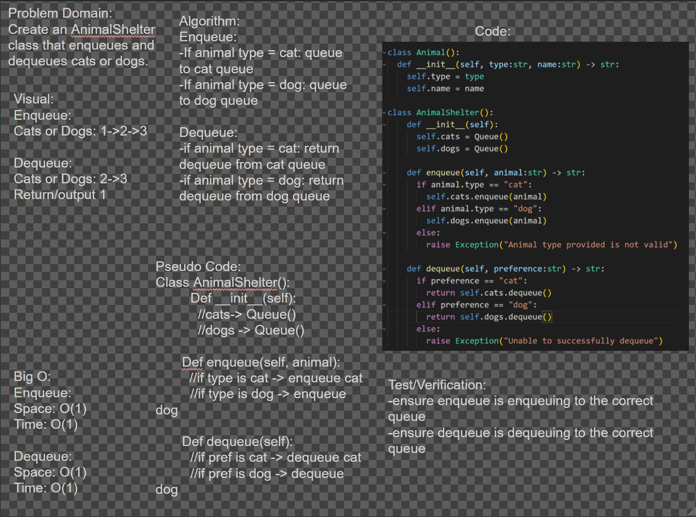
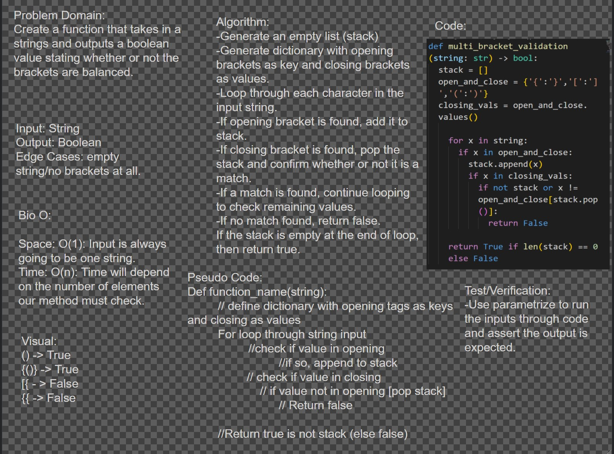
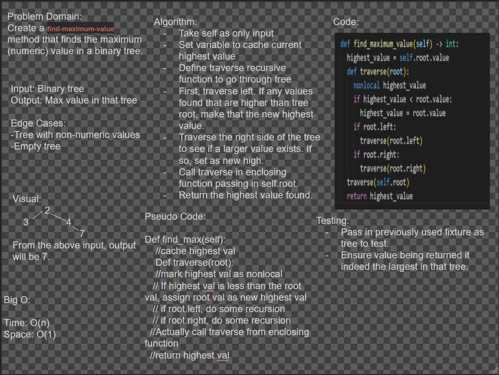
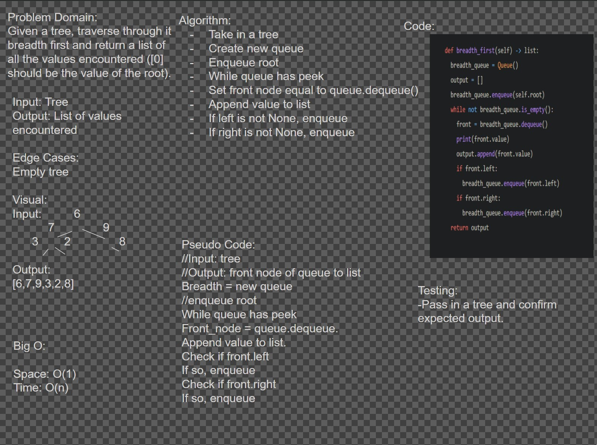
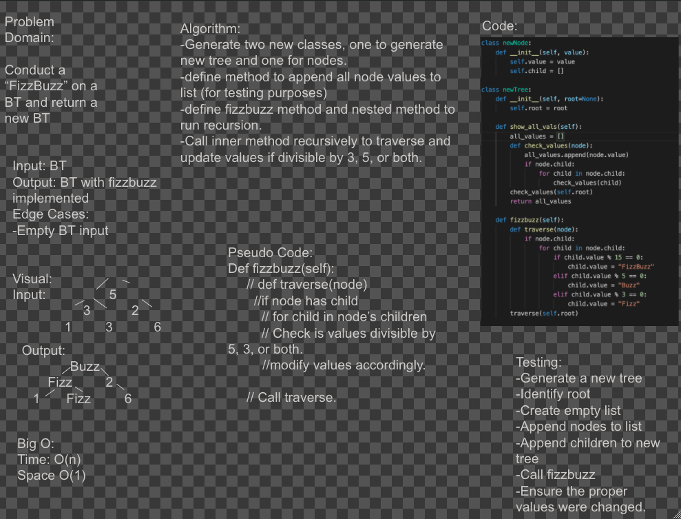
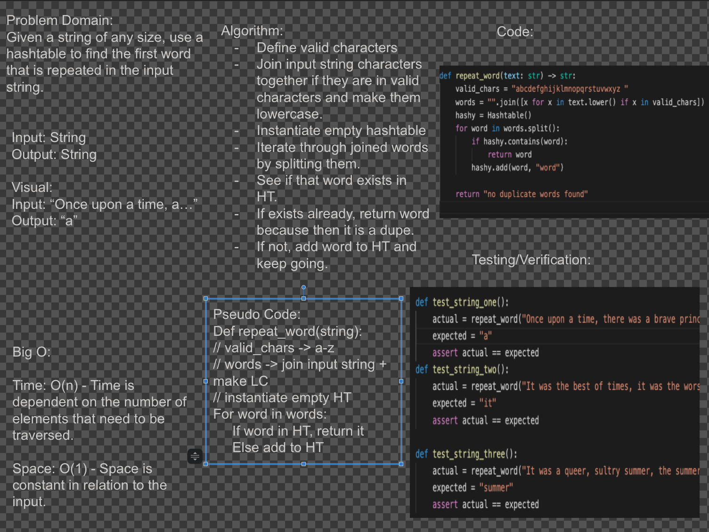
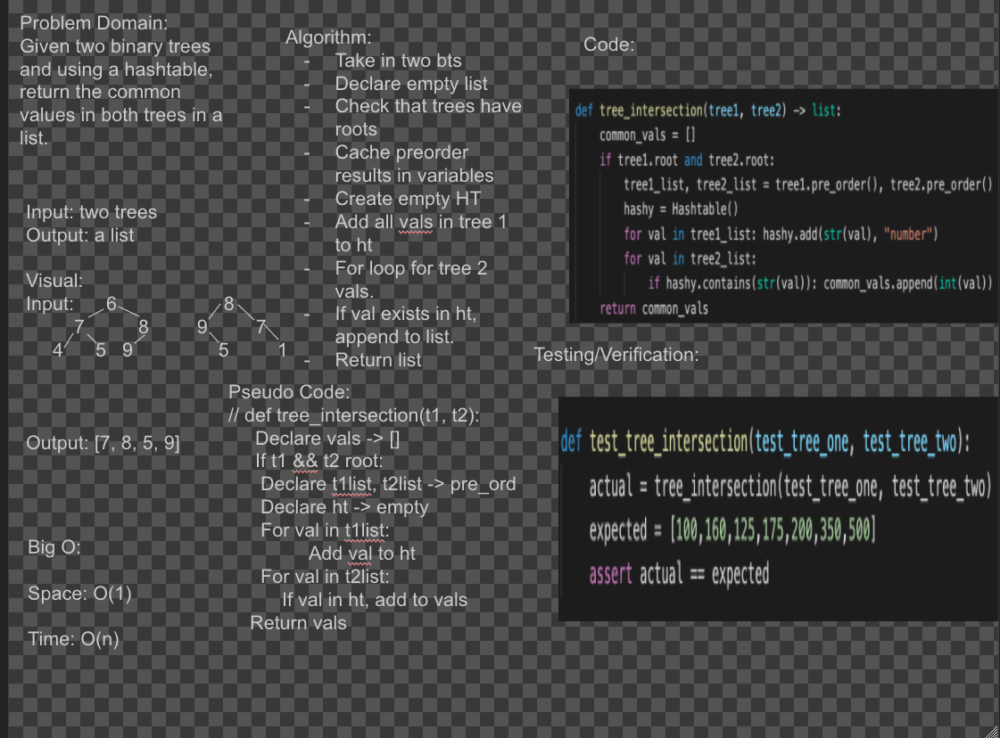
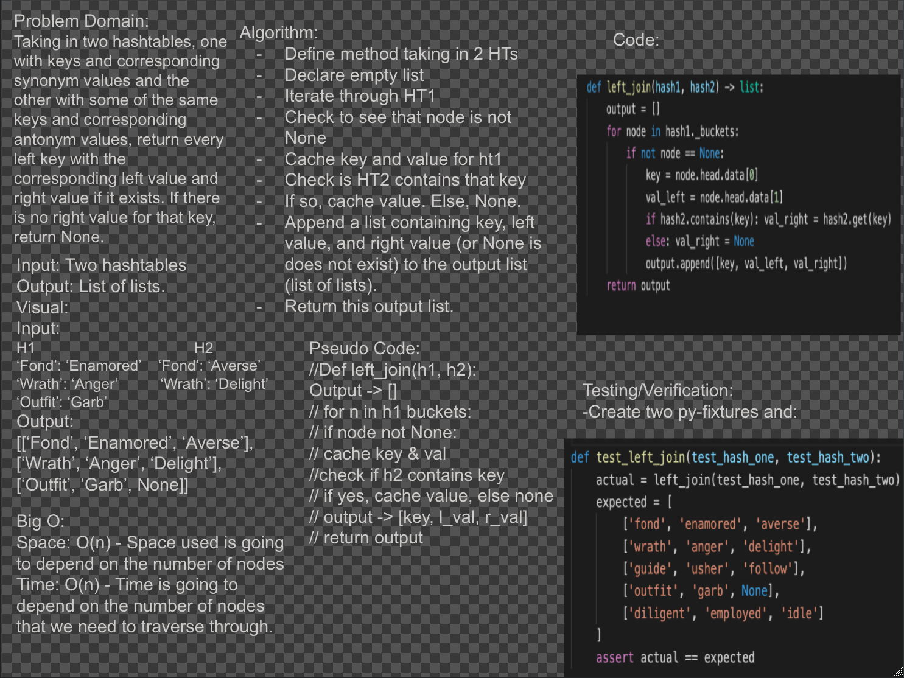

# Data Structures and Algorithms

## Language: `Python`

# Table of Contents Code 401

# Reverse an Array
[Code For Array Reverse Challenge](code_challenges/array_reverse/array_reverse.py)

## Challenge
Take list as an argument and reverse it without using any built-in Python reverse functions. 

## Approach & Efficiency
We kept it simple by creating a function that takes in a single list as an argument. We decided to use slicing to reverse the list because it results in short, easy-to-read code. Big O was O(N) - grows linearly and in direct proportion to the size of the input data set. 

## Solution


# Shift an Array
[Code For Array Shift Challenge](code_challenges/array_shift/array_shift.py)

## Challenge
When given a list (array) as an argument, along with a single value as a second argument, we want to be able to insert that value in the middle of the array without removing any pre-existing values in the array. We want to shift the existing values to the right of where the new value is being placed (the middle).

## Approach & Efficiency
We kept it simple by creating a function that takes in a list (array) and a new value to be added. We took the length of the list argument and divided by 2 to get the middle position. In case of an odd length, we then used math.ceil to ensure that length is rounded up. We then used insert() to insert the new value at the correct middle position. Finally, we returned the array with the new value. Big O was O(1) - Constant time algorithms take the same amount of time to be executed. Execution time of O(1) algorithms is independent of input size.

## Solution


# Array Binary Search
[Code For Array Binary Search Challenge](code_challenges/array_binary_search/array_binary_search.py)

## Challenge
Perform a binary search on a sorted array with only 2 arguments (arr and x). arr is the sorted array and x is the value we are looking for in the array. We want to return the index that x appears in the array. If x does not exist in the array we should return -1. 

## Approach & Efficiency
Created a function that takes in an ordered array and an integer and returns the index that the integer appears in the array. If the integer does not exist in the array, it will return -1. Defined low as 0 (always starting index of array), mid as 0 (to be updated as we go through the while loop), and high as length of array - 1 (to match 0 index concept). Then, find the middle value of the input array and determine whether it is less than, greater than, or equal to the integer argument. If equal, return middle index. If middle value is less than integer, ignore the left half. If middle value is greater than integer, ignore the right half. If the element is not present in the array, then return -1. Keep halving the array until value is found.

## Solution


# Singly Linked List

Linked List implementation with two classes: Node and LinkedList  
[Code for Singly Linked List Implementation](code_challenges/linked_list/linked_list.py)
## Challenge
Create two classes, LinkedList and Node. Using test-driven development, implement/test the following features:
1. Can successfully instantiate an empty linked list
2. Can properly insert into the linked list
3. The head property will properly point to the first node in the linked list
4. Can properly insert multiple nodes into the linked list
5. Will return true when finding a value within the linked list that exists
6. Will return false when searching for a value in the linked list that does not exist
7. Can properly return a collection of all the values that exist in the linked list

## Approach & Efficiency
For each of the features/requirements, I started by making a test that would prove that functionality. From there, I updated the Node and LinkedList classes to create the actual functionality that I would then test. After doing this for all of the features, I wrote docstrings to explain the purpose of each function that I constructed. 

## API
Methods:
- Node __init__: This is the Node Constructor. Value param is the value that the node will represent. Next (optional param) defaults to none and represents the next node in the list.
- LinkedList __init__: This is the constructor for the actual linked list. Head (optional param) defaults to none and represents the head of the linked list.
- LinkedList insert: Inserts a value to the head of the linked list. Takes in a value that the new node represents.
- LinkedList includes: Searches the linked list for a specific value. Takes in value we are searching for and outputs a boolean to indicate whether or not the value was found.
- LinkedList __str__: Produces a string representation of the linked list.

# Linked List Insertions
[Code For Linked List Insertions Challenge](code_challenges/linked_list/linked_list.py)

## Challenge
Using test-driven development, create functions that append an element to the end of a linked list, before a specified value, and after a specified value. 

## Approach & Efficiency
Node and LinkedList classes have already been created and tested. After writing each test, we went in to write the actual implementation function. After that, we ran the tests to make sure each function produces the expected values. Inserting at the head of the linked list is O(1) because it will always take the same amount of time. Inserting anywhere else in a linked list will be O(n) time because time is dependent on how many elements we need to traverse through. Space will be O(1) because the space required by the algorithm is constant. 

## Solution


# Linked List K-th Value From End 
[Code For Linked List K-th Value From End Challenge](code_challenges/linked_list/linked_list.py)

## Challenge
Using test-driven development, create a function that gets the kth value from the end where the last node in the linked list has an index of 0. Increments by 1 with each traversal to the left.

## Approach & Efficiency
Node and LinkedList classes have already been created and tested. After writing the test, we went in to write the actual implementation function. After that, we ran the tests to ensure that all feature requirements are met. Time: O(n) Space: O(1).

## Solution


# Zip two linked lists
[Code For Zip Two Linked Lists Challenge](code_challenges/ll_zip/ll_zip.py)

## Challenge
Take two linked lists as inputs, and we want to merge them together so that they alternate between values. If one list is longer than the other, start adding the extra values in order from the linked list that is longer than the other. Return a reference to head of zipped list. 

## Approach & Efficiency
Cache the head of both lists. While those both have values, cache the next node for each in separate variables. Set the next of the first list's first value to the second list's first value and so on, until one list runs out of nodes. In that case, the original sequence of the list with more nodes is continued until the end is reached. Utilized existing methods in the LinkedList class to test output. Time: O(n) Space: O(1).

## Solution


# Stacks and Queues
[Code For Stacks and Queues](code_challenges/stacks_and_queues/stacks_and_queues.py)

## Challenge
- Create a Node class that has properties for the value stored in the Node, and a pointer to the next node.
- Create a Stack class that has a top property. It creates an empty Stack when instantiated.
- Create a Queue class that has a front property. It creates an empty Queue when instantiated.

## Approach & Efficiency
- Can successfully push onto a stack
- Can successfully push multiple values onto a stack
- Can successfully pop off the stack
- Can successfully empty a stack after multiple pops
- Can successfully peek the next item on the stack
- Can successfully instantiate an empty stack
- Calling pop or peek on empty stack raises exception
- Can successfully enqueue into a queue
- Can successfully enqueue multiple values into a queue
- Can successfully dequeue out of a queue the expected value
- Can successfully peek into a queue, seeing the expected value
- Can successfully empty a queue after multiple dequeues
- Can successfully instantiate an empty queue
- Calling dequeue or peek on empty queue raises exception

## API
- Stack: 
1. method called push which takes any value as an argument and adds a new node with that value to the top of the stack with an O(1) Time performance.
2. method called pop that does not take any argument, removes the node from the top of the stack, and returns the node’s value.
3. Define a method called peek that does not take an argument and returns the value of the node located on top of the stack, without removing it from the stack.
4. method called isEmpty that takes no argument, and returns a boolean indicating whether or not the stack is empty.

- Queue: 
1. Define a method called enqueue which takes any value as an argument and adds a new node with that value to the back of the queue with an O(1) Time performance.
2. Define a method called dequeue that does not take any argument, removes the node from the front of the queue, and returns the node’s value.
3. Define a method called peek that does not take an argument and returns the value of the node located in the front of the queue, without removing it from the queue.
4. Define a method called isEmpty that takes no argument, and returns a boolean indicating whether or not the queue is empty.

# Implement a Queue using two Stacks

[Code For Implement a Queue using two Stacks](code_challenges/queue_with_stacks/queue_with_stacks.py)

## Challenge Summary
- Create a brand new PseudoQueue class with the methods enqueue and dequeue.

## Challenge Description
- Create a brand new PseudoQueue class. Do not use an existing Queue. Instead, this PseudoQueue class will implement our standard queue interface (the two methods listed below), but will internally only utilize 2 Stack objects. Ensure that you create your class with the following methods:

- enqueue(value) which inserts value into the PseudoQueue, using a first-in, first-out approach.
- dequeue() which extracts a value from the PseudoQueue, using a first-in, first-out approach.

## Approach & Efficiency
- Enqueue
    1. Space: O(1)
    2. Time: O(1)
- Dequeue
    1. Space: O(n)
    2. Time: O(n)

## Solution


# First-in, First out Animal Shelter

[Code For First-in, First out Animal Shelter](code_challenges/fifo_animal_shelter/fifo_animal_shelter.py)

## Challenge Summary
- Create a brand new AnimalShelter class with the methods enqueue and dequeue.

## Challenge Description
- Create a class called AnimalShelter which holds only dogs and cats. The shelter operates using a first-in, first-out approach.
- Implement the following methods:
    1. enqueue(animal): adds animal to the shelter. animal can be either a dog or a cat object.
    2. dequeue(pref): returns either a dog or a cat. If pref is not "dog" or "cat" then return null.

## Approach & Efficiency
- Enqueue
    1. Space: O(1)
    2. Time: O(1)
- Dequeue
    1. Space: O(1)
    2. Time: O(1)

## Solution


# Multi-bracket Validation

[Code For Multi-bracket Validation](code_challenges/multi_bracket_validation/multi_bracket_validation.py)

## Challenge Summary/Description
- Create a function that takes in a string and returns true or false depending on whether or not the brackets ('{}', '[]', '()') are balanced. 

## Approach & Efficiency
- Using a stack, I iterate through the string. The opening brackets are pushed onto the stack and then when a closing bracket is found, the corresponding opening bracket is popped out from the stack. If the stacks ends up being empty at the end, return true.  

Space: O(1)  
Time: O(n)

## Solution


# Trees  

Trees implementation with three classes: Node, BinaryTree, and BinarySearchTree   
[Code for Trees Implementation](code_challenges/tree/tree.py)  

## Challenge
Create three classes, Node, BinaryTree, and BinarySearchTree. Using test-driven development, implement/test the following features:
1. Can successfully instantiate an empty tree
2. Can successfully instantiate a tree with a single root node
3. Can successfully add a left child and right child to a single root node
4. Can successfully return a collection from a preorder traversal
5. Can successfully return a collection from an inorder traversal
6. Can successfully return a collection from a postorder traversal

## Approach & Efficiency
For each of the features/requirements, I started by making a test that would prove that functionality. From there, I updated the Node, BinaryTree, and BinarySearchTree classes to create the actual functionality. After doing this for all of the features, I confirmed all tests passing.

## API
Methods:
- Create a Node class that has properties for the value stored in the node, the left child node, and the right child node
- Create a BinaryTree class
    1. Define a method for each of the depth first traversals called preOrder, inOrder, and postOrder which returns an array of the values, ordered appropriately.
- Create a BinarySearchTree class
    1. Define a method named add that accepts a value, and adds a new node with that value in the correct location in the binary search tree.
    2. Define a method named contains that accepts a value, and returns a boolean indicating whether or not the value is in the tree at least once.
    
# Find the Maximum Value in a Binary Tree

[Code For This Challenge](code_challenges/tree/tree.py)  

## Challenge Summary/Description
- Find the Maximum Value in a Binary Tree

## Approach & Efficiency
- Using recursion, I go through each value in the tree and check if the new root is the highest value in that tree. One I have gone through the entire tree, return that value. 

Space: O(1)  
Time: O(n)

## Solution


# Breadth-first Traversal

[Code For This Challenge](code_challenges/tree/tree.py)  

## Challenge Summary/Description
- Print out values in a tree from a breadth first approach

## Approach & Efficiency
- I implemented breadth first using a queue and a while loop. In the while loop, I included the logic for traversing the tree breadth first.  

Space: O(1)  
Time: O(n)

## Solution


# Fizz Buzz Tree 

[Code For This Challenge](code_challenges/fizz_buzz_tree/fizz_buzz_tree.py)  

## Challenge Summary/Description
- Conduct a fizzbuzz on a BT and return a new BT. 

## Approach & Efficiency
- I created two new classes: one for creating new nodes and one for creating a new tree. Both have init methods. In the tree class, I created two methods: one to find all values in the tree and another to modify values if divisible by 3, 5, or both. 

Space: O(1)  
Time: O(n)

## Solution


# Insertion Sort 

[Code for this challenge](code_challenges/insertion_sort/insertion_sort.py)

[Trace for this challenge](code_challenges/insertion_sort/BLOG.md)

# Merge Sort 

[Code for this challenge](code_challenges/merge_sort/merge_sort.py)

[Trace for this challenge](code_challenges/merge_sort/BLOG.md)

# Quick Sort 

[Code for this challenge](code_challenges/quick_sort/quick_sort.py)

[Trace for this challenge](code_challenges/quick_sort/BLOG.md)

# Hash Tables
[Code for this challenge](code_challenges/hashtable/hashtable.py)
- A hash table stores key/value pairs by hashing the key and storing the pair in the index result. 

## Challenge
- Create a hash table implementation that allows adding, getting values, checking if a given key exists, and actually hashing a key. 

## Approach & Efficiency
- All of the methods above exist in the Hashtable class. The hash table is instantiated with 1024 buckets that have a default value of None. Collisions are handled with the linked list data structure. Efficiency: 
```
Method - Time - Space
hash   - O(1) - O(1)
add    - O(1) - O(1)
get    - O(n) - O(n)
contain- O(n) - O(n)
```
## API
```
Method - Params - Output
hash   - key    - hash code (int)
add    - key,val- None 
get    - key    - value
contain- key    - True or False
```
# Repeated Word Using Hash Table 
## Challenge Code
[Code here](code_challenges/repeated_word/repeated_word.py)

## Challenge Description
- Create a method that takes in a string and uses a hashtable to return the first word that is repeated twice. 

## Approach and Efficiency
- Space: O(1) (space is constant in relation to input)
- Time: O(n) (time is dependent on the number of elements that we need to traverse)

## Solution


# Tree Intersection 
## Challenge Code
[Code here](code_challenges/common_vals_bt/common_vals_bt.py)

## Challenge Description
- Create a method that takes in two bts and uses a hashtable to return all the common values between the trees.  

## Approach and Efficiency
- Space: O(1) (space is constant in relation to input)
- Time: O(n) (time is dependent on the number of elements that we need to traverse)

## Solution


# Left Join
## Challenge Code
[Code here](code_challenges/left_join/left_join.py)

## Challenge Description
- Taking in two hashtables, one with keys and corresponding synonym values and the other with some of the same keys and corresponding antonym values, return every left key with the corresponding left value and right value if it exists. If there is no right value for that key, return None. 

## Approach and Efficiency
- Space: O(n) (output list is dependent on the the number of non-empty nodes in the input hashtables
- Time: O(n) (time is dependent on the number of nodes that we need to traverse)

## Solution


# Graphs  
[Code for this challenge](code_challenges/graphs/graphs.py)
- A graph is a non-linear collection or potentially collected nodes.

## Challenge
- Create a graph implementation with the following classes: [Graph, Vertex, Edge] and the following methods inside Graph class: [add_node, add_edge, get_nodes, get_neighbors, size].

## Approach & Efficiency
- The Graph class was created with the methods mentioned about. This class uses the Vertex class to instantiate new nodes and the Edge class to instantiate new edges. 
- Note that all methods utilized have space and time efficiency of O(1). 
## API
```
def add_node(self, val) -> *returns the node being created*
add_edge(self, start, end, weight=1) -> obj:
get_nodes(self) -> list:
get_neighbors(self, vertex) -> dict:
size(self) -> str:
```
